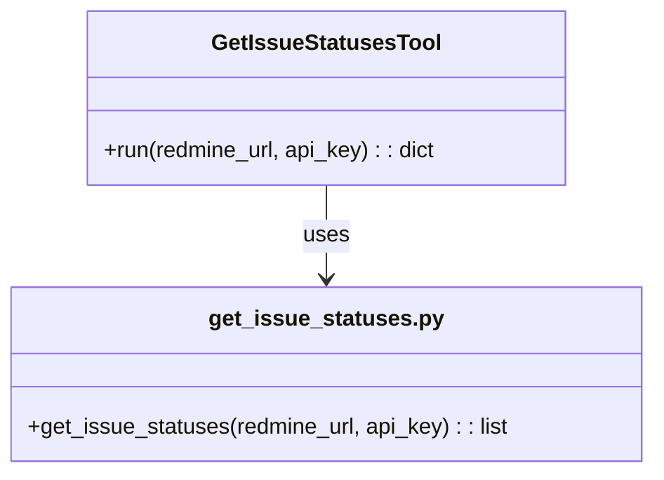

# IssueStatusesTool 設計書

## 1. 要件定義

### 概要
Redmineの課題ステータス（Issue Statuses）一覧を取得するツールを実装する。  
Redmine REST API `/issue_statuses.[format]` のGETリクエストをラップし、全ての課題ステータス情報（id, name, is_closed）を取得できること。

### ユースケース
- 課題登録・更新画面で利用可能なステータス一覧を取得する
- ステータスIDと名称のマッピングを取得する
- ステータスが「クローズ」かどうかの判定に利用する

### 非機能要件
- PEP8準拠
- GoogleスタイルDocstring
- ruffによる自動整形対応

---

## 2. API仕様

### エンドポイント
- メソッド: GET
- パス: `/issue_statuses.[format]`
- 説明: 全ての課題ステータスを取得する

#### リクエスト例
```
GET /issue_statuses.json
```

#### パラメータ
| 名前    | 型     | 必須 | 説明                       |
| ------- | ------ | ---- | -------------------------- |
| api_key | string | 必須 | Redmine APIキー            |
| format  | string | 任意 | レスポンス形式（json/xml） |

#### レスポンス例（JSON）
```json
{
  "issue_statuses": [
    {
      "id": 1,
      "name": "New",
      "is_closed": false
    },
    {
      "id": 2,
      "name": "Closed",
      "is_closed": true
    }
  ]
}
```

#### レスポンス例（XML）
```xml
<?xml version="1.0" encoding="UTF-8"?>
<issue_statuses type="array">
  <issue_status>
    <id>1</id>
    <name>New</name>
    <is_closed>false</is_closed>
  </issue_status>
  <issue_status>
    <id>2</id>
    <name>Closed</name>
    <is_closed>true</is_closed>
  </issue_status>
</issue_statuses>
```

#### エラー応答
- 認証エラー、権限エラー時はRedmine標準のエラー形式

---

## 3. 機能設計

### 機能概要
- Redmine REST API `/issue_statuses.[format]` にGETリクエストを送り、課題ステータス一覧を取得する
- レスポンスから `id`, `name`, `is_closed` を抽出し、Pythonの辞書またはリストとして返却する

### クラス構成
- `GetIssueStatusesTool`（ツール本体）
  - 入力: `redmine_url`, `api_key`
  - 出力: ステータス一覧（id, name, is_closed のリスト）

- `get_issue_statuses.py`（API呼び出しロジック）
  - Redmine REST APIへのリクエスト処理

### 入出力仕様

#### 入力
| パラメータ  | 型     | 必須 | 説明               |
| ----------- | ------ | ---- | ------------------ |
| redmine_url | string | 必須 | RedmineのベースURL |
| api_key     | string | 必須 | APIキー            |

#### 出力
| フィールド     | 型     | 説明                   |
| -------------- | ------ | ---------------------- |
| issue_statuses | list   | ステータス情報のリスト |
| └ id           | int    | ステータスID           |
| └ name         | string | ステータス名           |
| └ is_closed    | bool   | クローズ状態           |

---

## 4. クラス図（概略）



---

## 5. 処理フロー

1. ユーザーから `redmine_url` と `api_key` を受け取る
2. Redmine REST API `/issue_statuses.json` にGETリクエストを送信
3. レスポンスから `issue_statuses` 配列を抽出
4. 各要素（id, name, is_closed）をPythonのdictに変換
5. ステータス一覧を返却

---

## 6. テスト観点

- 正常系: ステータス一覧が正しく取得できる
- 異常系: APIキー不正、URL不正時のエラー処理
- ステータスが0件の場合の動作
- is_closedがtrue/false両方含まれる場合の判定

---

## 7. 備考

- レスポンス形式はJSONを標準とし、必要に応じてXMLも対応
- 他ツールの設計・実装方針に準拠
