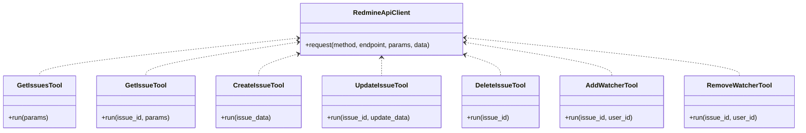

# Issues API設計書

## 1. 要件定義書

### 目的
Redmineの「課題（Issues）」に関する操作をAPI経由で行う。課題の一覧取得、詳細取得、作成、更新、削除、ウォッチャー追加・削除をサポートする。

### 対象ユーザー
- Redmine管理者・一般ユーザー
- 外部システム連携担当者

### 提供機能
- 課題一覧取得（フィルタ・ページング・ソート対応）
- 課題一覧取得（関連情報含む）
- 課題作成
- 課題更新
- 課題削除
- ウォッチャー追加
- ウォッチャー削除

---

## 2. 設計書

### 2.1 概略設計

- RedmineのREST APIをラップしたPythonツール群として実装
- 各機能ごとにtools/配下に1ファイルずつ作成
- APIクライアントはtools/redmine_api_client.pyを利用
- テストはtests/配下に同名ファイルで作成

### 2.2 機能一覧

| 機能名                | HTTPメソッド | エンドポイント例                | 説明                       |
|----------------------|--------------|-------------------------------|----------------------------|
| 課題一覧取得          | GET          | /issues.[format]              | フィルタ・ページング対応    |
| 課題詳細取得          | GET          | /issues/{id}.[format]         | 関連情報含む                |
| 課題作成              | POST         | /issues.[format]              |                            |
| 課題更新              | PUT          | /issues/{id}.[format]         |                            |
| 課題削除              | DELETE       | /issues/{id}.[format]         |                            |
| ウォッチャー追加      | POST         | /issues/{id}/watchers.[format]| user_id指定                 |
| ウォッチャー削除      | DELETE       | /issues/{id}/watchers/{user_id}.[format] |                |

### 2.3 クラス構成

### 2.4 API仕様（抜粋）

- 課題一覧取得:  
  - パラメータ: offset, limit, sort, include, 各種フィルタ
  - レスポンス: 課題リスト、ページ情報
- 課題詳細取得:  
  - パラメータ: include
  - レスポンス: 課題詳細情報
- 課題作成:  
  - パラメータ: issue属性（project_id, subject, ...）
  - レスポンス: 作成された課題情報
- 課題更新:  
  - パラメータ: issue属性（subject, notes, ...）
  - レスポンス: 更新後の課題情報
- 課題削除:  
  - パラメータ: なし
  - レスポンス: ステータスのみ
- ウォッチャー追加/削除:  
  - パラメータ: user_id
  - レスポンス: ステータスのみ

---

## 3. 今後の流れ

1. 本設計書のレビュー・修正
2. コード実装（tools/配下に各ツール作成）
3. テスト実装（tests/配下に各ツールのテスト作成）
4. 動作確認・修正

---

ご要望・修正点があればご指摘ください。問題なければ「Act mode」のまま実装を開始します。
