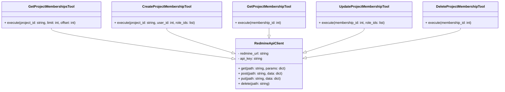

# Project Memberships 機能 設計書

## 1. 要件定義

Redmineのプロジェクトメンバーシップ情報を操作するためのAPIクライアント機能を提供する。
具体的には、以下の操作を可能とする。

- [x] プロジェクトメンバーシップの一覧取得
- [x] プロジェクトメンバーシップの詳細取得
- [x] プロジェクトメンバーシップの更新
- [ ] プロジェクトメンバーシップの作成
- [ ] プロジェクトメンバーシップの削除

※ 現状、作成と削除がうまく動いていない

## 2. 設計書

### 2.1. 概略設計

Redmine APIの `/projects/:project_id/memberships` および `/memberships/:id` エンドポイントを利用して、プロジェクトメンバーシップのCRUD操作を行うためのツール群を開発する。
各ツールは、Redmine APIクライアントを通じてRedmineサーバーと通信する。

### 2.2. 機能設計

#### 2.2.1. プロジェクトメンバーシップ一覧取得 (get_project_memberships)

- **機能概要:** 指定されたプロジェクトのメンバーシップ一覧を取得する。
- **エンドポイント:** `GET /projects/:project_id/memberships.:format`
- **入力:**
    - `project_id` (必須): プロジェクトIDまたは識別子
    - `limit` (任意): 取得件数の上限
    - `offset` (任意): 取得開始位置
- **出力:** メンバーシップ情報のリスト
- **主要な処理:**
    1. Redmine APIクライアントを利用して、指定されたプロジェクトのメンバーシップ一覧を取得する。
    2. 取得結果を整形して返す。

#### 2.2.2. プロジェクトメンバーシップ作成 (create_project_membership)

- **機能概要:** 指定されたプロジェクトに新しいメンバーシップを作成する。
- **エンドポイント:** `POST /projects/:project_id/memberships.:format`
- **入力:**
    - `project_id` (必須): プロジェクトIDまたは識別子
    - `user_id` (必須): ユーザーIDまたはグループID
    - `role_ids` (必須): ロールIDの配列
- **出力:** 作成されたメンバーシップ情報、またはエラー情報
- **主要な処理:**
    1. Redmine APIクライアントを利用して、指定された情報で新しいメンバーシップを作成する。
    2. 作成結果（成功時はメンバーシップ情報、失敗時はエラー情報）を返す。

#### 2.2.3. プロジェクトメンバーシップ詳細取得 (get_project_membership)

- **機能概要:** 指定されたIDのメンバーシップ詳細を取得する。
- **エンドポイント:** `GET /memberships/:id.:format`
- **入力:**
    - `membership_id` (必須): メンバーシップID
- **出力:** メンバーシップ詳細情報
- **主要な処理:**
    1. Redmine APIクライアントを利用して、指定されたIDのメンバーシップ詳細を取得する。
    2. 取得結果を整形して返す。

#### 2.2.4. プロジェクトメンバーシップ更新 (update_project_membership)

- **機能概要:** 指定されたIDのメンバーシップ情報を更新する。ロールのみ更新可能。
- **エンドポイント:** `PUT /memberships/:id.:format`
- **入力:**
    - `membership_id` (必須): メンバーシップID
    - `role_ids` (必須): 更新後のロールIDの配列
- **出力:** 更新成功時はステータスコード、失敗時はエラー情報
- **主要な処理:**
    1. Redmine APIクライアントを利用して、指定されたIDのメンバーシップ情報を更新する。
    2. 更新結果（成功時はステータスコード、失敗時はエラー情報）を返す。

#### 2.2.5. プロジェクトメンバーシップ削除 (delete_project_membership)

- **機能概要:** 指定されたIDのメンバーシップを削除する。
- **エンドポイント:** `DELETE /memberships/:id.:format`
- **入力:**
    - `membership_id` (必須): メンバーシップID
- **出力:** 削除成功時はステータスコード、失敗時はエラー情報
- **主要な処理:**
    1. Redmine APIクライアントを利用して、指定されたIDのメンバーシップを削除する。
    2. 削除結果（成功時はステータスコード、失敗時はエラー情報）を返す。

### 2.3. クラス構成

各機能は、個別のツールとして実装する。
共通のRedmine APIアクセス処理は `RedmineApiClient` クラス（既存または新規作成）に集約する。

## 3. 注意事項

- グループから継承されたメンバーシップは、直接削除・更新できない場合がある。APIの仕様に従い、適切なエラーハンドリングを行う。
- APIキーとRedmine URLは、設定ファイルまたは環境変数から取得することを想定する。
