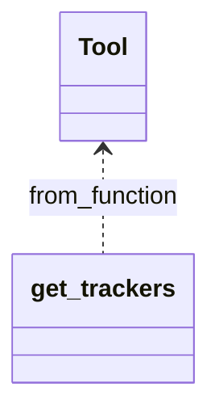

# Trackersツール設計書

## 1. 要件定義

RedmineのREST API `/trackers.(xml|json)` を利用し、全トラッカー情報を取得するツールを実装する。  
本ツールはRedmine MCPサーバの一部として、他ツールと同様のインターフェースで利用可能とする。

### 機能要件

- Redmineサーバから全トラッカー一覧を取得する
- レスポンスの各トラッカー情報には以下のフィールドを含む
  - id: トラッカーID
  - name: トラッカー名
  - default_status: デフォルトステータス（id, name）
  - description: 説明（Redmine 4.2.0以降）
  - enabled_standard_fields: 有効な標準フィールド（Redmine 5.0.0以降）

### 非機能要件

- PEP8準拠、GoogleスタイルDocstring、英語コメント
- pytestによるテストコード実装
- MCPツールとしてmain.pyに登録

## 2. API仕様

### エンドポイント

- `GET /trackers.json` または `GET /trackers.xml`

#### パラメータ

- なし

#### レスポンス例（JSON）

```json
{
  "trackers": [
    {
      "id": 1,
      "name": "Defect",
      "default_status": {
        "id": 1,
        "name": "New"
      },
      "description": null
    },
    {
      "id": 2,
      "name": "Feature",
      "default_status": {
        "id": 1,
        "name": "New"
      },
      "description": null
    }
  ]
}
```

#### フィールド説明

- id: int, トラッカーID
- name: str, トラッカー名
- default_status: dict, デフォルトステータス（id, name）
- description: str or null, 説明（Redmine 4.2.0以降, null許容）
- enabled_standard_fields: list[str], 有効な標準フィールド（Redmine 5.0.0以降、省略される場合あり）

## 3. 機能設計

### 3.1. Tracker取得関数

- 関数名: `get_trackers`
- 引数: 
  - redmine_url: str
  - api_key: str
- 戻り値: trackersリスト（dict形式）

### 3.2. MCPツール

- 実装方針: tools/IssueStatuses/GetIssueStatusesTool.py と同様に、Tool.from_function で get_trackers 関数をラップして GetTrackersTool を生成する
- モジュール構成例:
  - tools/Trackers/get_trackers.py ... API呼び出し関数
  - tools/Trackers/GetTrackersTool.py ... Tool.from_function によるツール定義

## 4. クラス構成



## 5. テスト設計

- pytestで `get_trackers` 関数の正常系・異常系テストを実装
- MCPツールクラスのテストも実装

---

以上の内容で設計しています。ご確認ください。
